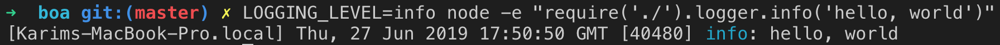

# boa [](https://circleci.com/gh/karimsa/boa)

Toolkit for building backends in Node.js.

- [Configuration](#configuration)
- [Logger](#logger)

## Configuration

- **Read string environment variable**: `Config.string('Redis.Password')` - This will read the environment variable `REDIS_PASSWORD` and will error out if the value is empty.
- **Read string environment variable with default value**: `Config.string('Redis.Password', 'blah')` - This will try to read the environment variable `REDIS_PASSWORD` and will return `blah` if the value is empty.
- **Read integer environment variable**: `Config.int('Redis.Port')` - This will read the environment variable `REDIS_PORT` and try to cast it to an integer. If the casting fails or the value is empty, it will fail.

Preloaded variables:

- `Config.NodeEnv` -> `process.env.NODE_ENV`
- `Config.isTestEnv` -> `true` if `NODE_ENV` is set to `test`.
- `Config.isDevelopmentEnv` -> `true` if `NODE_ENV` is set to `development`.

## Logger



The exported logger is a wrapper around a hidden winston logger, which by default logs to the console. The logging levels can be configured using the environment variable `LOGGING_LEVEL` - the default is to log `warn` and above. The levels are as follows:

- `error`
- `warn`
- `info`
- `verbose`

All loggers use `util.format()` & therefore whatever formatters are supported by your node version (see [docs](https://nodejs.org/api/util.html#util_util_format_format_args)).

The logger also comes with some extra builtin utilities:

- **errorf**: creates an error object where the message is formatted using the formatter.
- **fatalf**: builds an error using `errorf()` then throws it.
- **debug**: takes a namespace as the first parameter and only logs the formatted message if that namespace is enabled using `process.env.DEBUG`.

```javascript
import { logger } from '@karimsa/boa'

// errorf
const name = await fetchName()
const err = logger.errorf('Hello, %s', name)
// err = new Error('Hello, ' + name)

// fatalf
logger.fatalf('hello') // throw logger.errorf('hello')

// debug
logger.debug('myapi', 'hello, %s', name)
```

## License

Licensed under MIT license.

Copyright (C) 2019-present Karim Alibhai.
